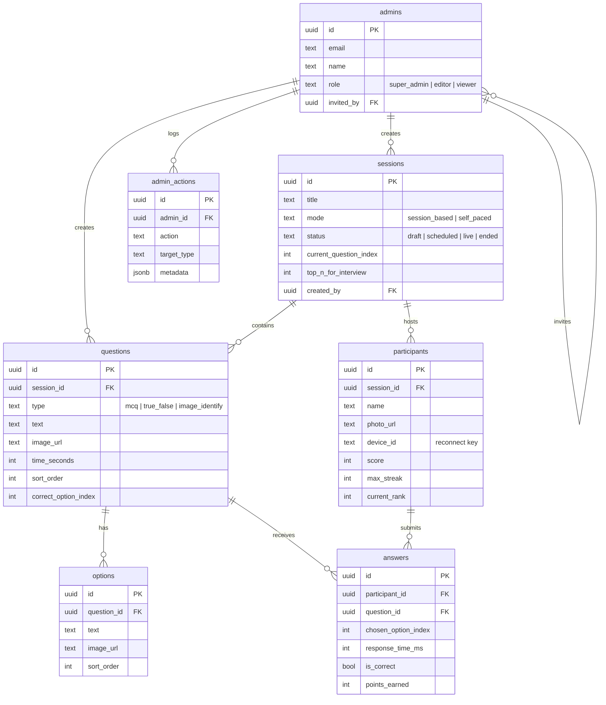

# edc-jssun-quiz

**Show what you know. Win an interview.** A live quiz platform for the JSSUN Orientation Programme — top 3 finishers earn a direct entry to the EDC personal interview.

## What it is

edc-jssun-quiz is a real-time quiz platform built by the Entrepreneurship Development Cell (EDC) at JSS University Noida for its Orientation Programme. Between 1000 and 2000 freshers join from their phones with nothing but a name and a photo — no signup, no login, no friction. Questions go live on the auditorium smart board, everyone answers on their own device, and a live leaderboard keeps the room on edge.

The hook: the **top 3 finishers skip the entire EDC selection process** and go straight to the personal interview round. Admins (invite-only, no public signup) control everything from a protected dashboard — building question sets, going live, pacing the quiz, and announcing winners.

## Screenshots

> Coming soon — will be added once the full UI is built.

<!--


-->

## Tech stack

- [Next.js 16](https://nextjs.org/docs) — App Router, TypeScript, Turbopack
- [React 19](https://react.dev)
- [Tailwind CSS v4](https://tailwindcss.com/docs) — CSS-first theme config
- [Supabase](https://supabase.com/docs) — Postgres, Auth, Realtime, RLS
- [Cloudinary](https://cloudinary.com/documentation) — image upload & delivery
- [Poppins](https://fonts.google.com/specimen/Poppins) via `next/font/google`

## Getting started

### Prerequisites

- Node.js 20.9+ (Next.js 16 minimum)
- npm 10+
- A [Supabase](https://supabase.com) project (free tier works)
- A [Cloudinary](https://cloudinary.com) account (free tier works)

### Installation

1. Clone the repo
2. `cd edc-jssun-quiz`
3. `npm install`
4. Copy `.env.example` to `.env.local` and fill in credentials
5. `npm run dev`
6. Open [http://localhost:3000](http://localhost:3000)

### One-time seed (required to test the join flow)

Participants can only join a session whose `status` is `'live'`. Until the admin dashboard exists, create one test session by running this **once** in the Supabase SQL Editor:

```sql
-- One-time seed: create a live test session
insert into sessions (title, description, mode, status, created_by)
values (
  'OP Test Session',
  'Testing the join flow',
  'session_based',
  'live',
  (select id from admins where role = 'super_admin' limit 1)
);
```

Also make sure Realtime is broadcasting the tables the waiting room listens to (Dashboard → Database → Replication → `supabase_realtime`, or run):

```sql
alter publication supabase_realtime add table participants, sessions;
```

### Testing on mobile / other devices on the network

To open the app on a phone while developing:

1. **Find your laptop's local IP.** On macOS run `ipconfig getifaddr en0`, or read the `Network:` line that `npm run dev` prints on startup.
2. **Put the phone on the same Wi-Fi network** as the laptop.
3. On the phone's browser, open `http://<your-laptop-ip>:3000`.

**Troubleshooting if the page won't load:**

- **Mac firewall** may be blocking incoming connections — check System Settings → Network → Firewall and allow Node/incoming connections.
- **Router client isolation** (common on guest networks) prevents devices from reaching each other — use a different network or a phone hotspot.
- **Corporate/campus Wi-Fi** often blocks peer-to-peer traffic entirely — a personal hotspot is the reliable fallback.

**Supabase auth over LAN IP:** auth works over the LAN address too. With `NEXT_PUBLIC_SITE_URL` set to localhost and `http://localhost:3000/**` in Supabase's redirect URLs, localhost testing is covered; for auth flows on the phone via LAN IP, additionally add `http://<your-laptop-ip>:3000/**` to Supabase → Authentication → URL Configuration → Redirect URLs during development.

### Environment variables

| Variable | Description | Where to get it |
| --- | --- | --- |
| `NEXT_PUBLIC_SUPABASE_URL` | Supabase project URL | Supabase → Project Settings → API |
| `NEXT_PUBLIC_SUPABASE_ANON_KEY` | Public anon key (RLS-restricted) | Supabase → Project Settings → API |
| `SUPABASE_SERVICE_ROLE_KEY` | ⚠️ Secret. Bypasses RLS — server only | Supabase → Project Settings → API |
| `NEXT_PUBLIC_CLOUDINARY_CLOUD_NAME` | Cloudinary cloud name | Cloudinary → Dashboard |
| `CLOUDINARY_API_KEY` | ⚠️ Secret. Cloudinary API key | Cloudinary → Dashboard → API Keys |
| `CLOUDINARY_API_SECRET` | ⚠️ Secret. Cloudinary API secret | Cloudinary → Dashboard → API Keys |
| `NEXT_PUBLIC_SITE_URL` | Base URL of the app | `http://localhost:3000` in dev; your domain in prod |

## Project structure

```
edc-jssun-quiz/
├── app/
│   ├── layout.tsx        # Root layout — Poppins, dark theme
│   ├── page.tsx          # Student landing page + Supabase connection check
│   ├── globals.css       # Tailwind v4 tokens (brand-cyan, brand-purple, award)
│   ├── join/             # Step 1: name entry · photo/: step 2 capture/upload
│   ├── waiting/          # Step 3: realtime waiting room
│   └── api/
│       ├── uploads/sign/         # Cloudinary signed-upload endpoint
│       └── participants/create/  # Participant create/reconnect endpoint
├── components/
│   └── progress-steps.tsx# Join-flow progress bar
├── lib/
│   ├── supabase/
│   │   ├── client.ts     # Browser client (anon key)
│   │   ├── server.ts     # Server client (auth cookies)
│   │   ├── middleware.ts # updateSession() helper for proxy.ts
│   │   └── admin.ts      # Service-role client (server-only)
│   ├── cloudinary/
│   │   └── upload.ts     # Browser → Cloudinary direct upload (signed)
│   └── device-id.ts      # Per-device UUID for reconnect
├── proxy.ts              # Next.js 16 proxy — session refresh + /admin guard
├── .env.example          # Env template (safe to commit)
└── .env.local            # Real credentials (never commit)
```

## Database schema

Seven tables in Supabase Postgres, RLS enabled on all:



`answers` has a unique constraint on (`participant_id`, `question_id`) — one answer per participant per question.

## Key flows

### Student flow

Steps 1–4 are live and verified end-to-end on iOS Simulator (Safari) and Android Emulator (Chrome), including cross-device Realtime updates in the waiting room:

1. Land on `/` — see the pitch and the top-3 prize
2. Tap **Get started** → `/join` — enter a name (step 1 of 3; input is hardened for mobile keyboards, IME/transliteration, and iOS autofill)
3. `/join/photo` — take a webcam photo or upload one (step 2 of 3); the photo goes browser → Cloudinary directly via a signed upload, then the app creates the participant row for the current live session (reconnects to the existing row if the same device rejoins)
4. `/waiting` — waiting room (step 3 of 3): your avatar + name, a live participant counter, and a "just joined" photo collage that grows in real time via Supabase Realtime as others join from their own devices
5. When the host advances the session, everyone is routed to `/quiz` — speed and streaks affect points *(Phase 3, upcoming)*
6. See final score and rank on `/result`; top 3 get the interview callout *(Phase 3, upcoming)*

### Admin flow

1. Log in at `/admin/login` (email + password; accounts are invite-only)
2. Create a session (title, mode, timing, top-N for interview)
3. Add questions (MCQ / true-false / image-identify) with options
4. Go live — students in the waiting room enter the quiz
5. Control pacing question by question, watch the live leaderboard
6. End the session and export/announce results

### Smart board flow

1. Open `/board/[session_id]` on the auditorium display
2. Board idles on branding until the session goes live
3. Each question projects with a countdown; answers lock when time's up
4. Leaderboard shows between questions
5. Final winners screen crowns the top 3 (amber highlight)

## Deployment

1. Push the repo to GitHub and import it in [Vercel](https://vercel.com)
2. Add all env vars from `.env.example` in Vercel → Project → Settings → Environment Variables
3. Set `NEXT_PUBLIC_SITE_URL` to your production domain
4. In Supabase → Authentication → URL Configuration, set the Site URL to the production domain and add it to redirect URLs
5. Deploy — Vercel runs `next build` (Turbopack) automatically

## Contributing

1. Fork the repo and create a feature branch
2. Make your changes (match the existing conventions, design tokens, and file structure)
3. Open a PR

## License

MIT

## Credits

Built for **EDC × JSS University Noida** Orientation Programme 2026.
